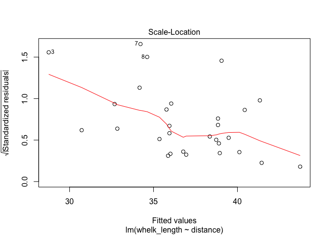
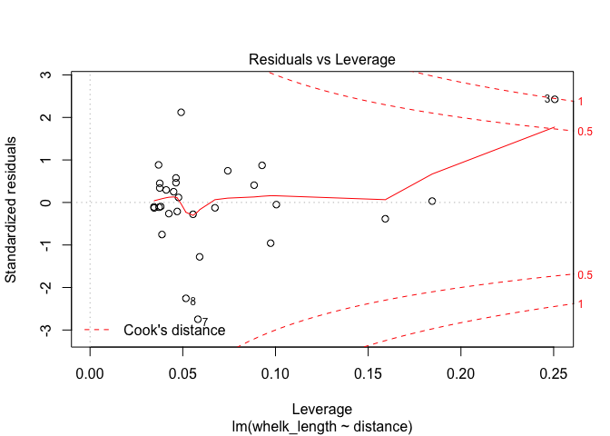
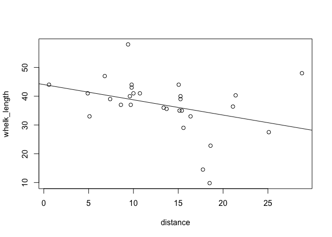

intro\_to\_r
================
Sandra Emry
2017-01-13

\#\# Introduction to r
----------------------

``` r
# calculator
5 + 9
```

    ## [1] 14

``` r
# assign values to variables
x <- 5
y <- 9
x + y
```

    ## [1] 14

``` r
# logical operators
x == y
```

    ## [1] FALSE

``` r
x != y
```

    ## [1] TRUE

``` r
x > y
```

    ## [1] FALSE

``` r
x < y
```

    ## [1] TRUE

``` r
# vector of numbers
a <- c(1,2,3,4)
a <- c(1:4)

# summary stats
sum(a)
```

    ## [1] 10

``` r
max(a)
```

    ## [1] 4

``` r
min(a)
```

    ## [1] 1

``` r
mean(a)
```

    ## [1] 2.5

``` r
var(a)
```

    ## [1] 1.666667

``` r
sd(a)
```

    ## [1] 1.290994

\#\# Introduction to dataframes
-------------------------------

``` r
# install gapminder package 
# install.packages("gapminder")

# load gapminder package
library(gapminder)

# look at structure of gapminder dataset
str(gapminder)
```

    ## Classes 'tbl_df', 'tbl' and 'data.frame':    1704 obs. of  6 variables:
    ##  $ country  : Factor w/ 142 levels "Afghanistan",..: 1 1 1 1 1 1 1 1 1 1 ...
    ##  $ continent: Factor w/ 5 levels "Africa","Americas",..: 3 3 3 3 3 3 3 3 3 3 ...
    ##  $ year     : int  1952 1957 1962 1967 1972 1977 1982 1987 1992 1997 ...
    ##  $ lifeExp  : num  28.8 30.3 32 34 36.1 ...
    ##  $ pop      : int  8425333 9240934 10267083 11537966 13079460 14880372 12881816 13867957 16317921 22227415 ...
    ##  $ gdpPercap: num  779 821 853 836 740 ...

``` r
# look at first few rows
head(gapminder)
```

    ## # A tibble: 6 × 6
    ##       country continent  year lifeExp      pop gdpPercap
    ##        <fctr>    <fctr> <int>   <dbl>    <int>     <dbl>
    ## 1 Afghanistan      Asia  1952  28.801  8425333  779.4453
    ## 2 Afghanistan      Asia  1957  30.332  9240934  820.8530
    ## 3 Afghanistan      Asia  1962  31.997 10267083  853.1007
    ## 4 Afghanistan      Asia  1967  34.020 11537966  836.1971
    ## 5 Afghanistan      Asia  1972  36.088 13079460  739.9811
    ## 6 Afghanistan      Asia  1977  38.438 14880372  786.1134

``` r
# names of columns
names(gapminder)
```

    ## [1] "country"   "continent" "year"      "lifeExp"   "pop"       "gdpPercap"

``` r
# how many columns?
ncol(gapminder)
```

    ## [1] 6

``` r
# how many rows?
nrow(gapminder)
```

    ## [1] 1704

``` r
# what are the dimensions?
dim(gapminder)
```

    ## [1] 1704    6

``` r
# length of dataframe
length(gapminder)
```

    ## [1] 6

``` r
# plot two variables
plot(lifeExp ~ continent, data = gapminder)
```


``` r
plot(lifeExp ~ gdpPercap, data = gapminder)
```


``` r
plot(lifeExp ~ log(gdpPercap), data = gapminder)
```


\#\# grazer habitat preference - t-tests
----------------------------------------

``` r
# clear workspace
rm(list = ls())

# set working directory to where your data files are located
setwd("/Users/sandraemry/Documents/biol326/data")

# load packages
suppressMessages(library(tidyverse))
```

    ## Warning: package 'ggplot2' was built under R version 3.3.2

``` r
# read in fucus data
habitat_pref <- read_csv("/Users/sandraemry/Documents/biol326/data/fucus.csv")
```

    ## Parsed with column specification:
    ## cols(
    ##   treatment = col_character(),
    ##   snails = col_integer(),
    ##   limpets = col_integer(),
    ##   student_initials = col_character()
    ## )

``` r
# structure of dataframe
str(habitat_pref)
```

    ## Classes 'tbl_df', 'tbl' and 'data.frame':    44 obs. of  4 variables:
    ##  $ treatment       : chr  "Fucus\n" "Fucus" "Fucus\n" "bare" ...
    ##  $ snails          : int  9 3 0 37 56 31 12 2 0 66 ...
    ##  $ limpets         : int  3 1 1 2 10 8 0 0 0 0 ...
    ##  $ student_initials: chr  "CC, BL" "CC, BL" "CC, BL" "CC, BL" ...
    ##  - attr(*, "spec")=List of 2
    ##   ..$ cols   :List of 4
    ##   .. ..$ treatment       : list()
    ##   .. .. ..- attr(*, "class")= chr  "collector_character" "collector"
    ##   .. ..$ snails          : list()
    ##   .. .. ..- attr(*, "class")= chr  "collector_integer" "collector"
    ##   .. ..$ limpets         : list()
    ##   .. .. ..- attr(*, "class")= chr  "collector_integer" "collector"
    ##   .. ..$ student_initials: list()
    ##   .. .. ..- attr(*, "class")= chr  "collector_character" "collector"
    ##   ..$ default: list()
    ##   .. ..- attr(*, "class")= chr  "collector_guess" "collector"
    ##   ..- attr(*, "class")= chr "col_spec"

``` r
# view entire dataset
View(habitat_pref)

# fix variable names - Fucus or fucus
unique(habitat_pref$treatment)
```

    ## [1] "Fucus\n" "Fucus"   "bare"    "fucus"   "Bare"

``` r
library(stringr)

habitat_pref$treatment[str_detect(habitat_pref$treatment, "Fucus\n")] <- "fucus"
habitat_pref$treatment[str_detect(habitat_pref$treatment, "Fucus")] <- "fucus"
habitat_pref$treatment[str_detect(habitat_pref$treatment, "Bare")] <- "bare"

# create variable for total grazers
habitat_pref <- habitat_pref %>% 
  mutate(total_grazers = (snails + limpets))

# check that your categorical variable is a factor
is.factor(habitat_pref$treatment)
```

    ## [1] FALSE

``` r
# to convert to factor
habitat_pref$treatment <- factor(habitat_pref$treatment)

# check that your categorical variable is a factor
is.factor(habitat_pref$treatment)
```

    ## [1] TRUE

``` r
# fit a linear model to data
model1<-lm(total_grazers ~ treatment, data = habitat_pref)

# parameter estimates and model fit
summary(model1)    
```

    ## 
    ## Call:
    ## lm(formula = total_grazers ~ treatment, data = habitat_pref)
    ## 
    ## Residuals:
    ##     Min      1Q  Median      3Q     Max 
    ## -21.818  -6.307  -1.636   5.864  44.182 
    ## 
    ## Coefficients:
    ##                Estimate Std. Error t value Pr(>|t|)    
    ## (Intercept)      21.818      3.310   6.592 5.59e-08 ***
    ## treatmentfucus  -15.682      4.681  -3.350  0.00171 ** 
    ## ---
    ## Signif. codes:  0 '***' 0.001 '**' 0.01 '*' 0.05 '.' 0.1 ' ' 1
    ## 
    ## Residual standard error: 15.52 on 42 degrees of freedom
    ## Multiple R-squared:  0.2109, Adjusted R-squared:  0.1921 
    ## F-statistic: 11.22 on 1 and 42 DF,  p-value: 0.001715

``` r
# check assumptions of model: plots of residuals, normal quantiles, leverage
par(mfrow = c(2,2))
plot(model1)
```


``` r
# ANOVA table
anova(model1)
```

    ## Analysis of Variance Table
    ## 
    ## Response: total_grazers
    ##           Df  Sum Sq Mean Sq F value   Pr(>F)   
    ## treatment  1  2705.1  2705.1  11.225 0.001715 **
    ## Residuals 42 10121.9   241.0                    
    ## ---
    ## Signif. codes:  0 '***' 0.001 '**' 0.01 '*' 0.05 '.' 0.1 ' ' 1

\#\# Boulder Sides - Paired t-test
----------------------------------

``` r
# read in boulder data
boulder <- read_csv("/Users/sandraemry/Documents/biol326/data/boulder.csv")
```

    ## Parsed with column specification:
    ## cols(
    ##   Boulder_ID = col_character(),
    ##   top = col_integer(),
    ##   bottom = col_integer(),
    ##   student_initials = col_character()
    ## )

``` r
# structure of dataframe
str(boulder)
```

    ## Classes 'tbl_df', 'tbl' and 'data.frame':    20 obs. of  4 variables:
    ##  $ Boulder_ID      : chr  "A" "B" "C" "D" ...
    ##  $ top             : int  4 3 4 1 1 1 1 4 2 3 ...
    ##  $ bottom          : int  4 5 6 6 3 4 3 1 2 1 ...
    ##  $ student_initials: chr  "CC, BL" "CC, BL" "CC, BL" "AA, PS" ...
    ##  - attr(*, "spec")=List of 2
    ##   ..$ cols   :List of 4
    ##   .. ..$ Boulder_ID      : list()
    ##   .. .. ..- attr(*, "class")= chr  "collector_character" "collector"
    ##   .. ..$ top             : list()
    ##   .. .. ..- attr(*, "class")= chr  "collector_integer" "collector"
    ##   .. ..$ bottom          : list()
    ##   .. .. ..- attr(*, "class")= chr  "collector_integer" "collector"
    ##   .. ..$ student_initials: list()
    ##   .. .. ..- attr(*, "class")= chr  "collector_character" "collector"
    ##   ..$ default: list()
    ##   .. ..- attr(*, "class")= chr  "collector_guess" "collector"
    ##   ..- attr(*, "class")= chr "col_spec"

``` r
# view entire dataset
View(boulder)

# check to see if data is normal
boulder <- boulder %>% 
  mutate(difference = top - bottom)

# histogram of the difference between top & bottom 
par(mfrow = c(1,1))
hist(boulder$difference)
```


``` r
# reshape dataset to a tidy one!
boulder <- gather(boulder, key = 'side', value = 'species_richness', top, bottom)

# view entire dataset
View(boulder)

# paired t - test
model2 <- t.test(species_richness  ~ side, data = boulder, paired = TRUE)
```

\#\# mussel size gradient - regression
--------------------------------------

``` r
mussels <- read_csv("/Users/sandraemry/documents/biol326/data/mussels.csv")
```

    ## Parsed with column specification:
    ## cols(
    ##   distance = col_double(),
    ##   mussel_length = col_double(),
    ##   student_initials = col_character()
    ## )

``` r
# structure of dataframe
str(mussels)
```

    ## Classes 'tbl_df', 'tbl' and 'data.frame':    40 obs. of  3 variables:
    ##  $ distance        : num  21.3 20.3 18.7 17.2 15.4 14.5 12.7 12 9.9 8.6 ...
    ##  $ mussel_length   : num  5 8 5 11 7.8 6 6.5 10.2 8.1 37 ...
    ##  $ student_initials: chr  "KB, KS" "KB, KS" "KB, KS" "KB, KS" ...
    ##  - attr(*, "spec")=List of 2
    ##   ..$ cols   :List of 3
    ##   .. ..$ distance        : list()
    ##   .. .. ..- attr(*, "class")= chr  "collector_double" "collector"
    ##   .. ..$ mussel_length   : list()
    ##   .. .. ..- attr(*, "class")= chr  "collector_double" "collector"
    ##   .. ..$ student_initials: list()
    ##   .. .. ..- attr(*, "class")= chr  "collector_character" "collector"
    ##   ..$ default: list()
    ##   .. ..- attr(*, "class")= chr  "collector_guess" "collector"
    ##   ..- attr(*, "class")= chr "col_spec"

``` r
# view entire dataset
View(mussels)

# model 3
model3 <- lm(mussel_length ~ distance, data = mussels)

# check assumptions
par(mfrow = c(2,2))
plot(model3)
```


``` r
# add a regression line to a scatter plot
par(mfrow = c(1,1))
plot(mussel_length ~ distance, data = mussels)
abline(model3)
```


``` r
# how to deal with outliers 


#estimates of slope, intercept and SEs
summary(model3)
```

    ## 
    ## Call:
    ## lm(formula = mussel_length ~ distance, data = mussels)
    ## 
    ## Residuals:
    ##    Min     1Q Median     3Q    Max 
    ## -8.586 -3.584 -1.517  1.070 33.140 
    ## 
    ## Coefficients:
    ##             Estimate Std. Error t value Pr(>|t|)    
    ## (Intercept)  20.2788     4.1775   4.854 2.09e-05 ***
    ## distance     -0.9439     0.3078  -3.067  0.00397 ** 
    ## ---
    ## Signif. codes:  0 '***' 0.001 '**' 0.01 '*' 0.05 '.' 0.1 ' ' 1
    ## 
    ## Residual standard error: 7.732 on 38 degrees of freedom
    ## Multiple R-squared:  0.1984, Adjusted R-squared:  0.1773 
    ## F-statistic: 9.407 on 1 and 38 DF,  p-value: 0.003971

``` r
confint(model3)
```

    ##                 2.5 %     97.5 %
    ## (Intercept) 11.822021 28.7356544
    ## distance    -1.566984 -0.3208872

``` r
# test H0 of zero slope 
anova(model3)
```

    ## Analysis of Variance Table
    ## 
    ## Response: mussel_length
    ##           Df Sum Sq Mean Sq F value   Pr(>F)   
    ## distance   1  562.4  562.40  9.4066 0.003971 **
    ## Residuals 38 2272.0   59.79                    
    ## ---
    ## Signif. codes:  0 '***' 0.001 '**' 0.01 '*' 0.05 '.' 0.1 ' ' 1

\#\# Whelk size gradient- regression
------------------------------------

``` r
whelks <- read_csv("/Users/sandraemry/Documents/biol326/data/whelks.csv")
```

    ## Parsed with column specification:
    ## cols(
    ##   distance = col_double(),
    ##   whelk_length = col_double(),
    ##   student_initials = col_character()
    ## )

``` r
# structure of dataset
str(whelks)
```

    ## Classes 'tbl_df', 'tbl' and 'data.frame':    29 obs. of  3 variables:
    ##  $ distance        : num  13.7 25.1 28.8 21.1 21.4 ...
    ##  $ whelk_length    : num  35.6 27.5 48 36.4 40.3 22.8 9.8 14.5 37 47 ...
    ##  $ student_initials: chr  "KB, KS" "BN, JS" "BN, JS" "BN, JS" ...
    ##  - attr(*, "spec")=List of 2
    ##   ..$ cols   :List of 3
    ##   .. ..$ distance        : list()
    ##   .. .. ..- attr(*, "class")= chr  "collector_double" "collector"
    ##   .. ..$ whelk_length    : list()
    ##   .. .. ..- attr(*, "class")= chr  "collector_double" "collector"
    ##   .. ..$ student_initials: list()
    ##   .. .. ..- attr(*, "class")= chr  "collector_character" "collector"
    ##   ..$ default: list()
    ##   .. ..- attr(*, "class")= chr  "collector_guess" "collector"
    ##   ..- attr(*, "class")= chr "col_spec"

``` r
# view entire dataset
View(whelks)

# model 4
model4 <- lm(whelk_length ~ distance, data = whelks)

# check assumptions
plot(model4)
```



``` r
# add a regression line to a scatter plot
plot(whelk_length ~ distance, data = whelks)
abline(model4)
```



``` r
# how to deal with unequal variance 


#estimates of slope, intercept and SEs
summary(model4)
```

    ## 
    ## Call:
    ## lm(formula = whelk_length ~ distance, data = whelks)
    ## 
    ## Residuals:
    ##      Min       1Q   Median       3Q      Max 
    ## -24.4242  -2.3545  -0.4411   4.0512  19.2416 
    ## 
    ## Coefficients:
    ##             Estimate Std. Error t value Pr(>|t|)    
    ## (Intercept)  44.0413     4.0806  10.793  2.7e-11 ***
    ## distance     -0.5307     0.2767  -1.918   0.0658 .  
    ## ---
    ## Signif. codes:  0 '***' 0.001 '**' 0.01 '*' 0.05 '.' 0.1 ' ' 1
    ## 
    ## Residual standard error: 9.162 on 27 degrees of freedom
    ## Multiple R-squared:  0.1199, Adjusted R-squared:  0.08731 
    ## F-statistic: 3.679 on 1 and 27 DF,  p-value: 0.06575

``` r
confint(model4)
```

    ##                 2.5 %      97.5 %
    ## (Intercept) 35.668609 52.41406352
    ## distance    -1.098361  0.03704389

``` r
# test H0 of zero slope 
anova(model4)
```

    ## Analysis of Variance Table
    ## 
    ## Response: whelk_length
    ##           Df  Sum Sq Mean Sq F value  Pr(>F)  
    ## distance   1  308.76 308.760  3.6785 0.06575 .
    ## Residuals 27 2266.28  83.936                  
    ## ---
    ## Signif. codes:  0 '***' 0.001 '**' 0.01 '*' 0.05 '.' 0.1 ' ' 1
