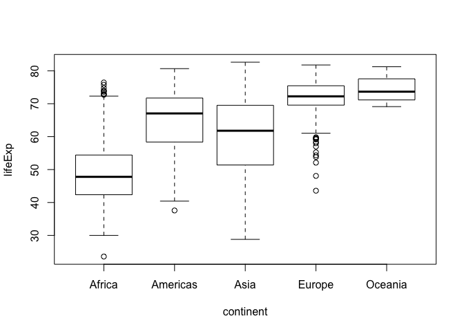
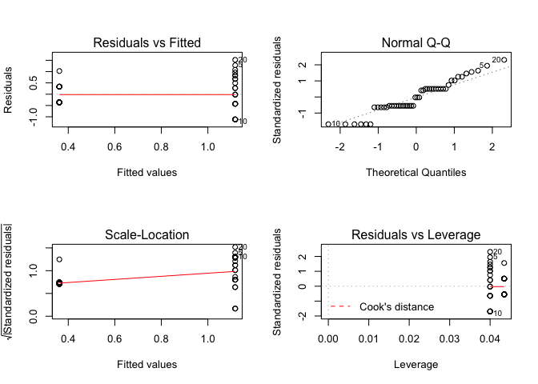

intro\_to\_r
================
Sandra Emry
2017-01-16

\#\# Introduction to r
----------------------

``` r
# you can use R as a calculator...
5 + 9
```

    ## [1] 14

``` r
# assign values to variables
# notice that it doesn't automatically print to screen. 
# you need to type the name of the variable afterwards to get it to show in the console
x <- 5
x
```

    ## [1] 5

``` r
y <- 9
y
```

    ## [1] 9

``` r
x + y
```

    ## [1] 14

``` r
# logical operators will create a vector give a 'FALSE' if the statement is not true, 
# and 'TRUE' if it is. 
# try and see if you can figure out what each of these do

x == y
```

    ## [1] FALSE

``` r
x != y
```

    ## [1] TRUE

``` r
x > y
```

    ## [1] FALSE

``` r
x < y
```

    ## [1] TRUE

``` r
# vector of numbers
# the c stands for concatenate, we use it to string more than one element together 
a <- c(1,2,3,4)
a <- c(1:4)

# summary stats

# sums all elements in the vector 'a' together
sum(a)
```

    ## [1] 10

``` r
# maximum number in the vector 'a'
max(a)
```

    ## [1] 4

``` r
# minimum number in the vector 'a'
min(a)
```

    ## [1] 1

``` r
# mean of numbers in the vector 'a'
mean(a)
```

    ## [1] 2.5

``` r
# variance
var(a)
```

    ## [1] 1.666667

``` r
# standard deviation
sd(a)
```

    ## [1] 1.290994

\#\# Introduction to dataframes
-------------------------------

``` r
# install gapminder package 
# install.packages("gapminder")

# load gapminder package
library(gapminder)

# look at structure of gapminder dataset
str(gapminder)
```

    ## Classes 'tbl_df', 'tbl' and 'data.frame':    1704 obs. of  6 variables:
    ##  $ country  : Factor w/ 142 levels "Afghanistan",..: 1 1 1 1 1 1 1 1 1 1 ...
    ##  $ continent: Factor w/ 5 levels "Africa","Americas",..: 3 3 3 3 3 3 3 3 3 3 ...
    ##  $ year     : int  1952 1957 1962 1967 1972 1977 1982 1987 1992 1997 ...
    ##  $ lifeExp  : num  28.8 30.3 32 34 36.1 ...
    ##  $ pop      : int  8425333 9240934 10267083 11537966 13079460 14880372 12881816 13867957 16317921 22227415 ...
    ##  $ gdpPercap: num  779 821 853 836 740 ...

``` r
# look at first few rows
head(gapminder)
```

    ## # A tibble: 6 × 6
    ##       country continent  year lifeExp      pop gdpPercap
    ##        <fctr>    <fctr> <int>   <dbl>    <int>     <dbl>
    ## 1 Afghanistan      Asia  1952  28.801  8425333  779.4453
    ## 2 Afghanistan      Asia  1957  30.332  9240934  820.8530
    ## 3 Afghanistan      Asia  1962  31.997 10267083  853.1007
    ## 4 Afghanistan      Asia  1967  34.020 11537966  836.1971
    ## 5 Afghanistan      Asia  1972  36.088 13079460  739.9811
    ## 6 Afghanistan      Asia  1977  38.438 14880372  786.1134

``` r
# names of columns
names(gapminder)
```

    ## [1] "country"   "continent" "year"      "lifeExp"   "pop"       "gdpPercap"

``` r
# how many columns?
ncol(gapminder)
```

    ## [1] 6

``` r
# how many rows?
nrow(gapminder)
```

    ## [1] 1704

``` r
# what are the dimensions?
dim(gapminder)
```

    ## [1] 1704    6

``` r
# length of dataframe
length(gapminder)
```

    ## [1] 6

``` r
# plot two variables
plot(lifeExp ~ continent, data = gapminder)
```



``` r
plot(lifeExp ~ gdpPercap, data = gapminder)
```


``` r
plot(lifeExp ~ log(gdpPercap), data = gapminder)
```


\#\# grazer habitat preference - t-tests
----------------------------------------

``` r
# clear workspace
# This isn't crucial, but it's good practice to start with a clean fresh global environment
rm(list = ls())

# set working directory to where your data files are located
# remember the shortcut in the bottom right panel, but copy and paste the code that runs in the
# console, and put it in your script for future use
setwd("/Users/sandraemry/Documents/biol326/data")

# load tidyverse package, this is important for the read_csv function
library(tidyverse)
```

    ## Loading tidyverse: ggplot2
    ## Loading tidyverse: tibble
    ## Loading tidyverse: tidyr
    ## Loading tidyverse: readr
    ## Loading tidyverse: purrr
    ## Loading tidyverse: dplyr

    ## Warning: package 'ggplot2' was built under R version 3.3.2

    ## Conflicts with tidy packages ----------------------------------------------

    ## filter(): dplyr, stats
    ## lag():    dplyr, stats

``` r
# load fucus data
# you can use the shortcut in the top right panel,  but copy and paste the code that runs in the
# console, and put it in your script for future use
habitat_pref <- read_csv("/Users/sandraemry/Documents/biol326/data/fucus.csv")
```

    ## Parsed with column specification:
    ## cols(
    ##   Treatment = col_character(),
    ##   snails = col_integer(),
    ##   limpets = col_integer(),
    ##   student_initials = col_character()
    ## )

``` r
# structure of dataframe
# I always str the data after I load it to understand what type of data it is
# and make sure that r read it correctly
str(habitat_pref)
```

    ## Classes 'tbl_df', 'tbl' and 'data.frame':    48 obs. of  4 variables:
    ##  $ Treatment       : chr  "Fucus\n" "Fucus" "Fucus\n" "bare" ...
    ##  $ snails          : int  9 3 0 37 56 31 12 2 0 66 ...
    ##  $ limpets         : int  3 1 1 2 10 8 0 0 0 0 ...
    ##  $ student_initials: chr  "CC, BL" "CC, BL" "CC, BL" "CC, BL" ...
    ##  - attr(*, "spec")=List of 2
    ##   ..$ cols   :List of 4
    ##   .. ..$ Treatment       : list()
    ##   .. .. ..- attr(*, "class")= chr  "collector_character" "collector"
    ##   .. ..$ snails          : list()
    ##   .. .. ..- attr(*, "class")= chr  "collector_integer" "collector"
    ##   .. ..$ limpets         : list()
    ##   .. .. ..- attr(*, "class")= chr  "collector_integer" "collector"
    ##   .. ..$ student_initials: list()
    ##   .. .. ..- attr(*, "class")= chr  "collector_character" "collector"
    ##   ..$ default: list()
    ##   .. ..- attr(*, "class")= chr  "collector_guess" "collector"
    ##   ..- attr(*, "class")= chr "col_spec"

``` r
# view entire dataset, will open up in a new tab 
View(habitat_pref)

# how many unique cases of the treatment variable?
# oops we have errors in our data entry
# r is very particular in spelling and doesn't like spaces
unique(habitat_pref$Treatment)
```

    ## [1] "Fucus\n" "Fucus"   "bare"    "fucus"   "Bare"

``` r
# load stringr package
# we will use this below to fix the different spellings of fucus and bare
library(stringr)

# fix variable names
habitat_pref <- habitat_pref %>% 
  mutate(Treatment = str_replace(Treatment, "(Fucus\n|Fucus|fucus\n)", "fucus")) %>% 
  mutate(Treatment = str_replace(Treatment, "Bare", "bare"))

# how many unique cases of the treatment variable?
# we should only have two now 
unique(habitat_pref$Treatment)
```

    ## [1] "fucus" "bare"

``` r
# check that your categorical variable is a factor
# this is important for how r treats the data when fitting the linear model
# you can think of a factor as a categorical variable
is.factor(habitat_pref$Treatment)
```

    ## [1] FALSE

``` r
# convert to factor
habitat_pref$Treatment <- factor(habitat_pref$Treatment)

# fit a linear model to data for limpets
# format: lm(dependent variable ~ independent variable, data = name of dataframe)
model1a <- lm(limpets ~ Treatment, data = habitat_pref)

# check assumptions of model: plots of residuals, normal quantiles, leverage
# this sets up the plotting area to plot the graphs 2 rows, by 2 columns
par(mfrow = c(2,2))

plot(model1a)
```


``` r
# our data doesn't seem to meet the assumptions of normality or equal variance, 
# let's try logging the independent variable
model1a_logged <- lm(log(limpets +1) ~ Treatment, data = habitat_pref)

# check the assumptions again to see if logging the data helped 

par(mfrow = c(2,2))

plot(model1a_logged) # looks better!
```



``` r
# parameter estimates and model fit
summary(model1a_logged)   
```

    ## 
    ## Call:
    ## lm(formula = log(limpets + 1) ~ Treatment, data = habitat_pref)
    ## 
    ## Residuals:
    ##      Min       1Q   Median       3Q      Max 
    ## -1.11730 -0.36164 -0.01869  0.33151  1.52176 
    ## 
    ## Coefficients:
    ##                Estimate Std. Error t value Pr(>|t|)    
    ## (Intercept)      1.1173     0.1346   8.303 1.06e-10 ***
    ## Treatmentfucus  -0.7557     0.1944  -3.887 0.000324 ***
    ## ---
    ## Signif. codes:  0 '***' 0.001 '**' 0.01 '*' 0.05 '.' 0.1 ' ' 1
    ## 
    ## Residual standard error: 0.6729 on 46 degrees of freedom
    ## Multiple R-squared:  0.2472, Adjusted R-squared:  0.2309 
    ## F-statistic: 15.11 on 1 and 46 DF,  p-value: 0.000324

``` r
# ANOVA table
# use this one for the p-value
anova(model1a_logged)
```

    ## Analysis of Variance Table
    ## 
    ## Response: log(limpets + 1)
    ##           Df  Sum Sq Mean Sq F value   Pr(>F)    
    ## Treatment  1  6.8404  6.8404  15.108 0.000324 ***
    ## Residuals 46 20.8265  0.4528                     
    ## ---
    ## Signif. codes:  0 '***' 0.001 '**' 0.01 '*' 0.05 '.' 0.1 ' ' 1

``` r
# moving on to the snail data!
# fit a linear model to data for snails
model1b <- lm(snails ~ Treatment, data = habitat_pref)

# check assumptions of model: plots of residuals, normal quantiles, leverage
par(mfrow = c(2,2))
plot(model1b)
```


``` r
# let's try logging it as we did above
model1b_logged <- lm(log(snails + 1) ~ Treatment, data = habitat_pref)

# recheck assumptions of model
par(mfrow = c(2,2))
plot(model1b_logged) # looks better
```


``` r
# parameter estimates and model fit
summary(model1b)    
```

    ## 
    ## Call:
    ## lm(formula = snails ~ Treatment, data = habitat_pref)
    ## 
    ## Residuals:
    ##     Min      1Q  Median      3Q     Max 
    ## -18.840  -8.090  -2.935   6.214  47.160 
    ## 
    ## Coefficients:
    ##                Estimate Std. Error t value Pr(>|t|)    
    ## (Intercept)      18.840      2.986   6.310 9.93e-08 ***
    ## Treatmentfucus  -12.405      4.314  -2.876  0.00609 ** 
    ## ---
    ## Signif. codes:  0 '***' 0.001 '**' 0.01 '*' 0.05 '.' 0.1 ' ' 1
    ## 
    ## Residual standard error: 14.93 on 46 degrees of freedom
    ## Multiple R-squared:  0.1524, Adjusted R-squared:  0.134 
    ## F-statistic: 8.271 on 1 and 46 DF,  p-value: 0.006086

``` r
# ANOVA table
anova(model1b)
```

    ## Analysis of Variance Table
    ## 
    ## Response: snails
    ##           Df  Sum Sq Mean Sq F value   Pr(>F)   
    ## Treatment  1  1843.5 1843.47  8.2707 0.006086 **
    ## Residuals 46 10253.0  222.89                    
    ## ---
    ## Signif. codes:  0 '***' 0.001 '**' 0.01 '*' 0.05 '.' 0.1 ' ' 1

\#\# Boulder Sides - Paired t-test
----------------------------------

``` r
# read in boulder data
boulder <- read_csv("/Users/sandraemry/Documents/biol326/data/boulder.csv")
```

    ## Parsed with column specification:
    ## cols(
    ##   Boulder_ID = col_character(),
    ##   top = col_integer(),
    ##   bottom = col_integer(),
    ##   student_initials = col_character()
    ## )

``` r
# structure of dataframe
str(boulder)
```

    ## Classes 'tbl_df', 'tbl' and 'data.frame':    24 obs. of  4 variables:
    ##  $ Boulder_ID      : chr  "A" "B" "C" "D" ...
    ##  $ top             : int  4 3 4 1 1 1 1 4 2 3 ...
    ##  $ bottom          : int  4 5 6 6 3 4 3 1 2 1 ...
    ##  $ student_initials: chr  "CC, BL" "CC, BL" "CC, BL" "AA, PS" ...
    ##  - attr(*, "spec")=List of 2
    ##   ..$ cols   :List of 4
    ##   .. ..$ Boulder_ID      : list()
    ##   .. .. ..- attr(*, "class")= chr  "collector_character" "collector"
    ##   .. ..$ top             : list()
    ##   .. .. ..- attr(*, "class")= chr  "collector_integer" "collector"
    ##   .. ..$ bottom          : list()
    ##   .. .. ..- attr(*, "class")= chr  "collector_integer" "collector"
    ##   .. ..$ student_initials: list()
    ##   .. .. ..- attr(*, "class")= chr  "collector_character" "collector"
    ##   ..$ default: list()
    ##   .. ..- attr(*, "class")= chr  "collector_guess" "collector"
    ##   ..- attr(*, "class")= chr "col_spec"

``` r
# view entire dataset
View(boulder)

# check to see if data is normal
# in paired t tests, it's the difference between the paired columns that need to be normal
# create a column for the difference between the two sides
boulder <- boulder %>% 
  mutate(difference = top - bottom)

# check for normality
# the data points should more or less fall along the line 
par(mfrow = c(1,1))
qqnorm(boulder$difference)
qqline(boulder$difference)
```


``` r
# histogram of the difference between top & bottom 
# you can also use a histogram to check for normality
hist(boulder$difference)
```


``` r
# reshape dataset to a tidy one!
# r likes datasets to be formatted a certain way
# each row is an observation and each column is a variable
# we can reshape the dataframe from excel to create a dataframe that r prefers
boulder <- gather(boulder, key = 'side', value = 'species_richness', top, bottom)

# view entire dataset
# Can you tell what changed?
View(boulder)

# paired t - test
model2 <- t.test(species_richness  ~ side, data = boulder, paired = TRUE, var.equal = TRUE)

# test statistic, degrees of freedom = df, p-value
model2
```

    ## 
    ##  Paired t-test
    ## 
    ## data:  species_richness by side
    ## t = 3.5846, df = 23, p-value = 0.001568
    ## alternative hypothesis: true difference in means is not equal to 0
    ## 95 percent confidence interval:
    ##  0.704833 2.628500
    ## sample estimates:
    ## mean of the differences 
    ##                1.666667

\#\# mussel size gradient - regression
--------------------------------------

``` r
# load mussel data 
mussels <- read_csv("/Users/sandraemry/documents/biol326/data/mussels.csv")
```

    ## Parsed with column specification:
    ## cols(
    ##   distance = col_double(),
    ##   mussel_length = col_double(),
    ##   student_initials = col_character()
    ## )

``` r
# structure of dataframe
str(mussels)
```

    ## Classes 'tbl_df', 'tbl' and 'data.frame':    44 obs. of  3 variables:
    ##  $ distance        : num  21.3 20.3 18.7 17.2 15.4 14.5 12.7 12 9.9 8.6 ...
    ##  $ mussel_length   : num  5 8 5 11 7.8 6 6.5 10.2 8.1 37 ...
    ##  $ student_initials: chr  "KB, KS" "KB, KS" "KB, KS" "KB, KS" ...
    ##  - attr(*, "spec")=List of 2
    ##   ..$ cols   :List of 3
    ##   .. ..$ distance        : list()
    ##   .. .. ..- attr(*, "class")= chr  "collector_double" "collector"
    ##   .. ..$ mussel_length   : list()
    ##   .. .. ..- attr(*, "class")= chr  "collector_double" "collector"
    ##   .. ..$ student_initials: list()
    ##   .. .. ..- attr(*, "class")= chr  "collector_character" "collector"
    ##   ..$ default: list()
    ##   .. ..- attr(*, "class")= chr  "collector_guess" "collector"
    ##   ..- attr(*, "class")= chr "col_spec"

``` r
# view entire dataset
View(mussels)

# model 3
model3 <- lm(mussel_length ~ distance, data = mussels)

# check assumptions
par(mfrow = c(2,2))
plot(model3)
```


``` r
# the normal Q-Q plot shows us that points 10 and 11 seem to be outliters
# also, by looking at the 4th plot, residuals vc leverage, check for data that fall outside the dashed lines
# these are data that are particularly influential on your regression line
# in our case they are borderline
# first step: check your data, many times they may be just be data entry errors
# if it's real data, we can't exclude it from our stats

# how to deal with outliers 
# install.packages("car")
library(car)
```

    ## 
    ## Attaching package: 'car'

    ## The following object is masked from 'package:dplyr':
    ## 
    ##     recode

    ## The following object is masked from 'package:purrr':
    ## 
    ##     some

``` r
outlierTest(model3) #any sig outliers indicated as p<0.
```

    ##    rstudent unadjusted p-value Bonferonni p
    ## 11 6.714865         4.1704e-08   1.8350e-06
    ## 10 4.072755         2.0717e-04   9.1153e-03

``` r
# tells us that both points are significant outliers

ncvTest(model3) # significance test for homoscedasticity, if p<0.05 there's a problem
```

    ## Non-constant Variance Score Test 
    ## Variance formula: ~ fitted.values 
    ## Chisquare = 21.33872    Df = 1     p = 3.848796e-06

``` r
# we also don't have equal variance

# let's log transform the dependent variable
model3_logged <- lm(log(mussel_length) ~ distance, data = mussels)

# recheck assumptions
par(mfrow = c(2,2))
plot(model3_logged)
```


``` r
outlierTest(model3_logged)
```

    ## 
    ## No Studentized residuals with Bonferonni p < 0.05
    ## Largest |rstudent|:
    ##    rstudent unadjusted p-value Bonferonni p
    ## 11 2.781498          0.0081389      0.35811

``` r
ncvTest(model3_logged)
```

    ## Non-constant Variance Score Test 
    ## Variance formula: ~ fitted.values 
    ## Chisquare = 0.002501696    Df = 1     p = 0.9601089

``` r
# all look much better now! 

# estimates of slope, intercept, standard errors and r^2 value
summary(model3_logged)
```

    ## 
    ## Call:
    ## lm(formula = log(mussel_length) ~ distance, data = mussels)
    ## 
    ## Residuals:
    ##      Min       1Q   Median       3Q      Max 
    ## -1.45734 -0.23763  0.02789  0.34078  1.52108 
    ## 
    ## Coefficients:
    ##             Estimate Std. Error t value Pr(>|t|)    
    ## (Intercept)  2.92783    0.29561   9.905 1.49e-12 ***
    ## distance    -0.08805    0.02249  -3.915 0.000325 ***
    ## ---
    ## Signif. codes:  0 '***' 0.001 '**' 0.01 '*' 0.05 '.' 0.1 ' ' 1
    ## 
    ## Residual standard error: 0.6098 on 42 degrees of freedom
    ## Multiple R-squared:  0.2674, Adjusted R-squared:   0.25 
    ## F-statistic: 15.33 on 1 and 42 DF,  p-value: 0.0003254

``` r
# confidence intervals of the parameter estimates
confint(model3)
```

    ##                 2.5 %     97.5 %
    ## (Intercept) 11.405437 26.0937422
    ## distance    -1.406274 -0.2888285

``` r
# test H0 of zero slope 
anova(model3_logged)
```

    ## Analysis of Variance Table
    ## 
    ## Response: log(mussel_length)
    ##           Df  Sum Sq Mean Sq F value    Pr(>F)    
    ## distance   1  5.7008  5.7008  15.331 0.0003254 ***
    ## Residuals 42 15.6181  0.3719                      
    ## ---
    ## Signif. codes:  0 '***' 0.001 '**' 0.01 '*' 0.05 '.' 0.1 ' ' 1

``` r
# use a scatter plot to view the data
par(mfrow = c(1,1))
plot(log(mussel_length) ~ distance, data = mussels)
# add a regression line to the scatter plot
abline(model3_logged)
```


\#\# Whelk size gradient- regression
------------------------------------

``` r
# load in whelk data
whelks <- read_csv("/Users/sandraemry/Documents/biol326/data/whelks.csv")
```

    ## Parsed with column specification:
    ## cols(
    ##   distance = col_double(),
    ##   whelk_length = col_double(),
    ##   student_initials = col_character()
    ## )

``` r
# structure of dataset
str(whelks)
```

    ## Classes 'tbl_df', 'tbl' and 'data.frame':    29 obs. of  3 variables:
    ##  $ distance        : num  13.7 25.1 28.8 21.1 21.4 ...
    ##  $ whelk_length    : num  35.6 27.5 48 36.4 40.3 22.8 9.8 14.5 37 47 ...
    ##  $ student_initials: chr  "KB, KS" "BN, JS" "BN, JS" "BN, JS" ...
    ##  - attr(*, "spec")=List of 2
    ##   ..$ cols   :List of 3
    ##   .. ..$ distance        : list()
    ##   .. .. ..- attr(*, "class")= chr  "collector_double" "collector"
    ##   .. ..$ whelk_length    : list()
    ##   .. .. ..- attr(*, "class")= chr  "collector_double" "collector"
    ##   .. ..$ student_initials: list()
    ##   .. .. ..- attr(*, "class")= chr  "collector_character" "collector"
    ##   ..$ default: list()
    ##   .. ..- attr(*, "class")= chr  "collector_guess" "collector"
    ##   ..- attr(*, "class")= chr "col_spec"

``` r
# view entire dataset
View(whelks)

# model 4
model4 <- lm(whelk_length ~ distance, data = whelks)

# check assumptions
par(mfrow = c(2,2))
plot(model4) # not great but not the worst...
```


``` r
# estimates of slope, intercept, standard errors and r^2 value
summary(model4)
```

    ## 
    ## Call:
    ## lm(formula = whelk_length ~ distance, data = whelks)
    ## 
    ## Residuals:
    ##      Min       1Q   Median       3Q      Max 
    ## -24.4242  -2.3545  -0.4411   4.0512  19.2416 
    ## 
    ## Coefficients:
    ##             Estimate Std. Error t value Pr(>|t|)    
    ## (Intercept)  44.0413     4.0806  10.793  2.7e-11 ***
    ## distance     -0.5307     0.2767  -1.918   0.0658 .  
    ## ---
    ## Signif. codes:  0 '***' 0.001 '**' 0.01 '*' 0.05 '.' 0.1 ' ' 1
    ## 
    ## Residual standard error: 9.162 on 27 degrees of freedom
    ## Multiple R-squared:  0.1199, Adjusted R-squared:  0.08731 
    ## F-statistic: 3.679 on 1 and 27 DF,  p-value: 0.06575

``` r
# confidence intervals of the parameter estimates
confint(model4)
```

    ##                 2.5 %      97.5 %
    ## (Intercept) 35.668609 52.41406352
    ## distance    -1.098361  0.03704389

``` r
# test H0 of zero slope 
anova(model4)
```

    ## Analysis of Variance Table
    ## 
    ## Response: whelk_length
    ##           Df  Sum Sq Mean Sq F value  Pr(>F)  
    ## distance   1  308.76 308.760  3.6785 0.06575 .
    ## Residuals 27 2266.28  83.936                  
    ## ---
    ## Signif. codes:  0 '***' 0.001 '**' 0.01 '*' 0.05 '.' 0.1 ' ' 1

``` r
# add a regression line to a scatter plot
par(mfrow = c(1,1))
plot(whelk_length ~ distance, data = whelks)
abline(model4)
```


